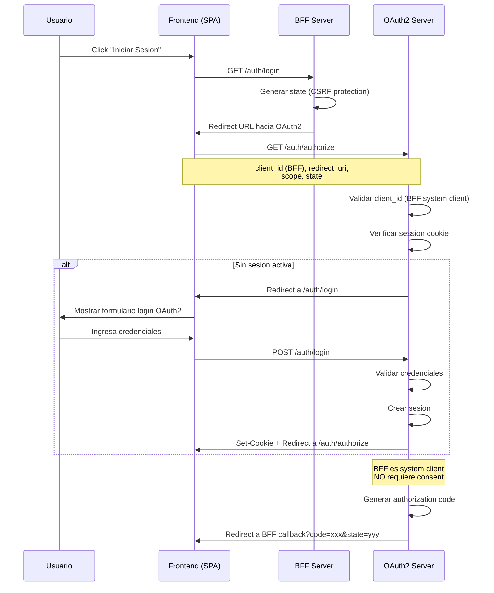
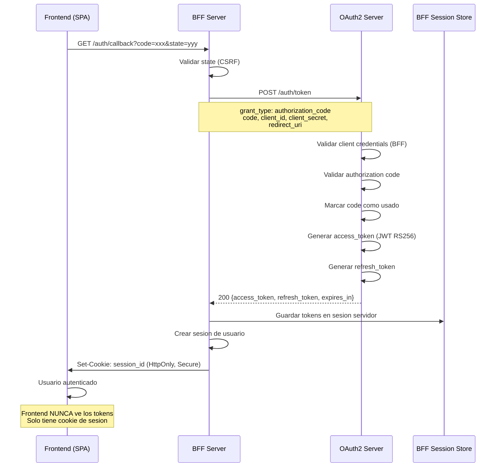
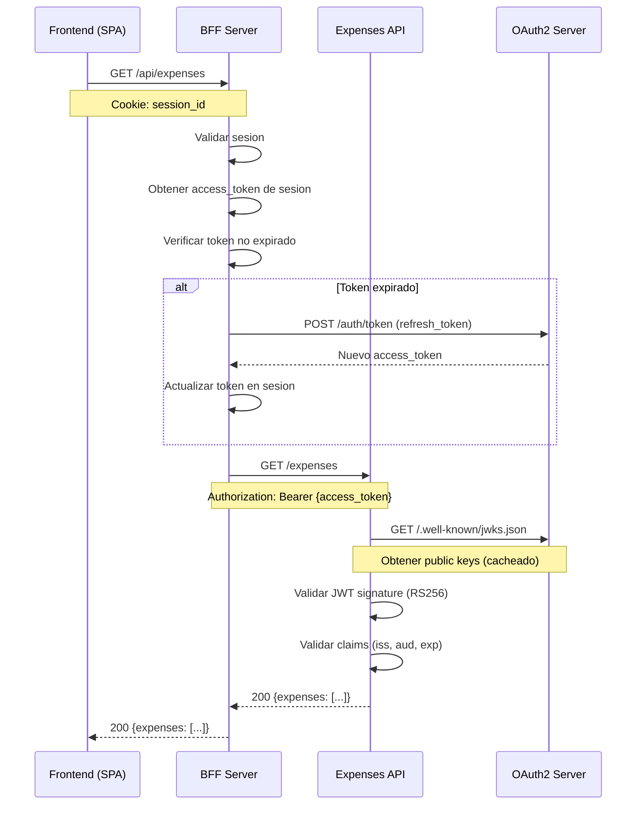
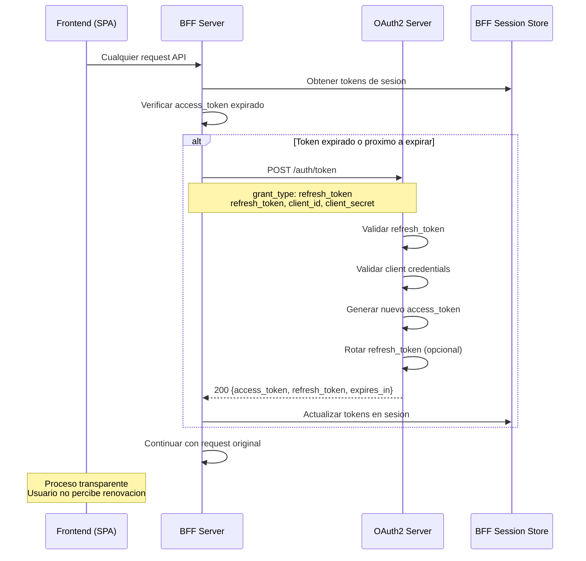
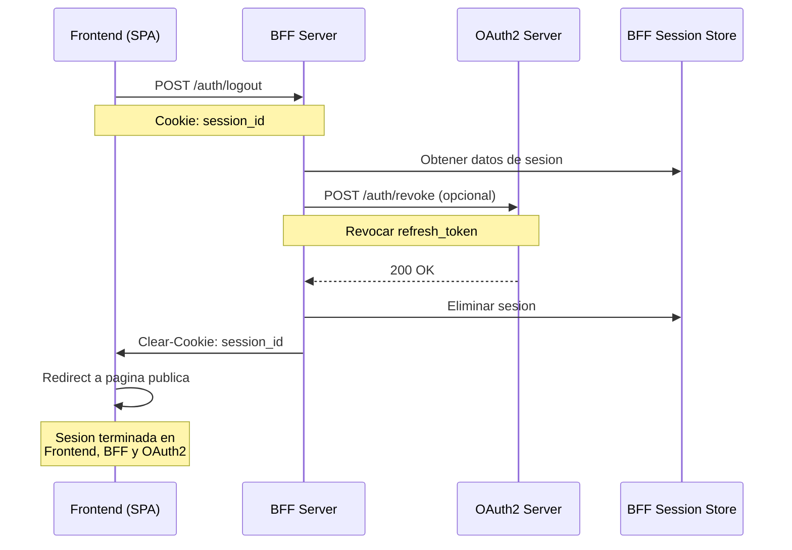
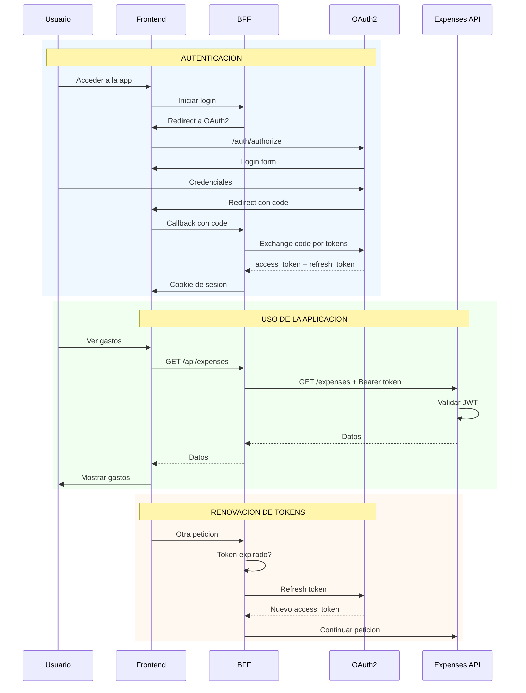

# ByteBerry-OAuth2

Servidor OAuth2 con Authorization Code + PKCE, JWT RS256, refresh tokens y JWKS. Implementa Clean Architecture con TypeScript, PostgreSQL y Docker multi-arch para Raspberry Pi 5.

[](https://github.com/JRuvalcabaFSD/ByteBerry-OAuth2/actions)
[](https://github.com/JRuvalcabaFSD/ByteBerry-OAuth2/tags)
[](https://nodejs.org)
[](https://pnpm.io)
[](https://www.typescriptlang.org/)
[](LICENSE)
[](https://hub.docker.com/r/jruvalcabafsd/byteberry-oauth2)

## Características

- **OAuth2 Authorization Code + PKCE** - Flujo seguro con code challenge S256
- **JWT RS256** - Tokens firmados con RSA-256 (firma asimetrica)
- **Refresh Tokens** - Sesiones extendidas sin re-autenticacion
- **JWKS Endpoint** - Distribucion de llaves publicas para validacion
- **Clean Architecture** - Separacion clara de capas (domain, application, infrastructure)
- **Account Types** - Soporte para usuarios User Account (Default) y Developer Account
- **Consentimiento de Usuario** - Pantalla de consentimiento personalizable
- **Rotacion de Secrets** - Rotacion segura de client secrets
- **Testing Completo** - Tests unitarios e integracion con Vitest
- **Logging con Winston** - Logs estructurados y niveles configurables
- **Validacion con Zod** - Esquemas de validacion estricta para entradas
- **Tailwind CSS** - Estilos utilitarios para interfaces limpias y responsivas
- **PostgreSQL + Prisma** - Base de datos relacional con ORM tipado
- **Docker Multi-arch** - Soporte para x64 y ARM64 (Raspberry Pi)

## Flujos OAuth2

### Arquitectura BFF (Backend for Frontend)

El sistema implementa el patron BFF donde el Frontend (SPA) nunca maneja tokens directamente. El BFF actua como cliente confidencial del servidor OAuth2 y gestiona los tokens de forma segura.

```
┌─────────────┐     ┌─────────────┐     ┌─────────────┐     ┌─────────────┐
│  Frontend   │────▶│     BFF     │────▶│   OAuth2    │     │  Expenses   │
│    (SPA)    │◀────│   Server    │◀────│   Server    │     │     API     │
└─────────────┘     └──────┬──────┘     └─────────────┘     └─────────────┘
                           │                                       ▲
                           │         Access Token (JWT)            │
                           └───────────────────────────────────────┘
```

**Caracteristicas del BFF como System Client:**
- Cliente confidencial (no publico) - no requiere PKCE
- No requiere consentimiento del usuario (consent implicito)
- Gestiona tokens en el servidor (el frontend solo usa cookies de sesion)
- Soporta `authorization_code` y `refresh_token` grant types

---

### 1. Login Flow (Frontend → BFF → OAuth2)

Inicio del flujo de autenticacion desde el Frontend.



---

### 2. Token Exchange Flow (BFF ↔ OAuth2)

El BFF intercambia el authorization code por tokens (el Frontend nunca ve los tokens).



---

### 3. Protected Resource Access (Frontend → BFF → Expenses API)

Acceso a recursos protegidos a traves del BFF.



---

### 4. Token Refresh Flow (BFF → OAuth2)

Renovacion automatica de tokens sin intervencion del usuario.



---

### 5. Logout Flow (Frontend → BFF → OAuth2)

Cierre de sesion completo en todos los servicios.



---

### Flujo Completo: Diagrama de Secuencia General



## Requisitos Previos

- Node.js >= 20.21.1
- pnpm >= 10.20.0
- PostgreSQL 15+
- Docker (opcional, para desarrollo con contenedores)

## Instalacion

```bash
# Clonar repositorio
git clone https://github.com/JRuvalcabaFSD/ByteBerry-OAuth2.git
cd ByteBerry-OAuth2

# Instalar dependencias
pnpm install

# Configurar variables de entorno
cp .env.example .env

# Generar cliente Prisma
pnpm db generate

# Iniciar base de datos y ejecutar migraciones
pnpm db:setup

# Iniciar en modo desarrollo
pnpm dev
```

## Variables de Entorno

| Variable                       | Descripcion                        | Default       |
| ------------------------------ | ---------------------------------- | ------------- |
| `NODE_ENV`                     | Entorno de ejecucion               | `development` |
| `PORT`                         | Puerto del servidor                | `4000`        |
| `DATABASE_URL`                 | URL de conexion PostgreSQL         | -             |
| `JWT_ISSUER`                   | Emisor de tokens JWT               | -             |
| `JWT_AUDIENCE`                 | Audiencia de tokens                | -             |
| `JWT_ACCESS_TOKEN_EXPIRES_IN`  | Expiracion access token (segundos) | `900`         |
| `JWT_REFRESH_TOKEN_EXPIRES_IN` | Expiracion refresh token           | `7d`          |
| `OAUTH2_PKCE_REQUIRED`         | Requerir PKCE                      | `true`        |
| `OAUTH2_PKCE_METHODS`          | Metodos PKCE permitidos            | `S256`        |
| `CORS_ORIGINS`                 | Origenes CORS permitidos           | -             |

Ver `.env.example` para la lista completa de variables.

## Scripts Disponibles

### Desarrollo

| Comando        | Descripcion                                       |
| -------------- | ------------------------------------------------- |
| `pnpm dev`     | Inicia servidor en modo desarrollo con hot-reload |
| `pnpm dev:app` | Solo servidor (sin compilar CSS)                  |
| `pnpm dev:css` | Solo compilar Tailwind CSS en modo watch          |

### Build

| Comando          | Descripcion                            |
| ---------------- | -------------------------------------- |
| `pnpm build`     | Compila TypeScript, CSS y copia assets |
| `pnpm build:ts`  | Solo compilar TypeScript               |
| `pnpm build:css` | Solo compilar Tailwind CSS             |
| `pnpm start`     | Ejecuta version compilada              |
| `pnpm clean`     | Elimina directorio dist/               |

### Base de Datos

| Comando               | Descripcion                                     |
| --------------------- | ----------------------------------------------- |
| `pnpm db:up`          | Inicia contenedor PostgreSQL                    |
| `pnpm db:down`        | Detiene y elimina contenedor                    |
| `pnpm db:setup`       | Setup completo (up + generate + migrate + seed) |
| `pnpm db:reset`       | Resetea base de datos                           |
| `pnpm db:seed`        | Ejecuta seeds                                   |
| `pnpm db:studio`      | Abre Prisma Studio                              |
| `pnpm db generate`    | Genera cliente Prisma                           |
| `pnpm db migrate dev` | Ejecuta migraciones en desarrollo               |

### Testing

| Comando                 | Descripcion                           |
| ----------------------- | ------------------------------------- |
| `pnpm test`             | Ejecuta todos los tests               |
| `pnpm test:unit`        | Solo tests unitarios                  |
| `pnpm test:integration` | Solo tests de integracion             |
| `pnpm test:all`         | Tests unitarios + integracion         |
| `pnpm test:coverage`    | Tests con reporte de cobertura        |
| `pnpm test:watch`       | Tests en modo watch                   |
| `pnpm test:ui`          | Tests con interfaz visual (Vitest UI) |
| `pnpm test:ci`          | Pipeline completo para CI             |

### Calidad de Codigo

| Comando           | Descripcion                      |
| ----------------- | -------------------------------- |
| `pnpm lint`       | Ejecuta ESLint                   |
| `pnpm lint:fix`   | ESLint con auto-fix              |
| `pnpm type-check` | Verificacion de tipos TypeScript |
| `pnpm quality`    | type-check + lint + tests        |

### Docker

| Comando              | Descripcion                       |
| -------------------- | --------------------------------- |
| `pnpm docker:build`  | Construye imagen Docker           |
| `pnpm docker:run`    | Ejecuta con docker-compose        |
| `pnpm generate:keys` | Genera par de llaves RSA para JWT |

## Estructura del Proyecto

```
src/
├── application/           # Capa de aplicacion
│   ├── dtos/             # Data Transfer Objects
│   ├── use-cases/        # Casos de uso
│   │   ├── auth/         # Autenticacion y autorizacion
│   │   ├── client/       # Gestion de clientes OAuth
│   │   ├── consent/      # Consentimientos de usuario
│   │   └── user/         # Gestion de usuarios
│   └── validate-schemas/ # Esquemas de validacion Zod
├── config/               # Configuracion de la aplicacion
├── container/            # Contenedor de dependencias
├── domain/               # Capa de dominio
│   ├── entities/         # Entidades de negocio
│   ├── errors/           # Errores de dominio
│   └── value-objects/    # Value Objects
├── infrastructure/       # Capa de infraestructura
│   ├── http/             # Servidor HTTP y middlewares
│   ├── lifecycle/        # Graceful shutdown
│   ├── mappers/          # Mapeadores entidad <-> DTO
│   ├── repositories/     # Repositorios Prisma
│   └── services/         # Servicios (JWT, logging, etc.)
├── interfaces/           # Contratos e interfaces
├── presentation/         # Capa de presentacion
│   ├── controller/       # Controladores HTTP
│   ├── middleware/       # Middlewares de ruta
│   └── routes/           # Definicion de rutas
└── shared/               # Utilidades compartidas
    ├── decorators/       # Decoradores (DI, logging)
    ├── errors/           # Errores compartidos
    └── helpers/          # Funciones utilitarias
```

## API Endpoints

### Autenticacion OAuth2

| Metodo | Endpoint                      | Descripcion                         |
| ------ | ----------------------------- | ----------------------------------- |
| GET    | `/auth/login`                 | Formulario de login                 |
| POST   | `/auth/login`                 | Autenticar credenciales             |
| GET    | `/auth/authorize`             | Iniciar flujo OAuth2                |
| GET    | `/auth/authorize/consent`     | Pantalla de consentimiento          |
| PUT    | `/auth/authorize/decision`    | Procesar decision de consentimiento |
| POST   | `/auth/token`                 | Intercambiar codigo por tokens      |
| GET    | `/auth/.well-known/jwks.json` | Llaves publicas JWKS                |

### Usuarios

| Metodo | Endpoint            | Descripcion        |
| ------ | ------------------- | ------------------ |
| POST   | `/user`             | Registrar usuario  |
| GET    | `/user/me`          | Obtener perfil     |
| PUT    | `/user/me`          | Actualizar perfil  |
| PUT    | `/user/me/password` | Cambiar contrasena |

### Clientes OAuth

| Metodo | Endpoint                    | Descripcion        |
| ------ | --------------------------- | ------------------ |
| POST   | `/client`                   | Crear cliente      |
| GET    | `/client`                   | Listar clientes    |
| GET    | `/client/:id`               | Obtener cliente    |
| PUT    | `/client/:id`               | Actualizar cliente |
| DELETE | `/client/:id`               | Eliminar cliente   |
| POST   | `/client/:id/rotate-secret` | Rotar secreto      |

### Health Check

| Metodo | Endpoint       | Descripcion         |
| ------ | -------------- | ------------------- |
| GET    | `/health`      | Health check basico |
| GET    | `/health/deep` | Health check con DB |

## Docker

### Build local

```bash
pnpm docker:build
```

### Ejecutar con docker-compose

```bash
# Desarrollo
docker-compose up -d

# Ver logs
docker-compose logs -f byteberry-oauth2
```

### Imagen desde Docker Hub

```bash
docker pull jruvalcabafsd/byteberry-oauth2:latest
```

## Testing

El proyecto usa Vitest con configuraciones separadas:

```bash
# Tests unitarios (mocks)
pnpm test:unit

# Tests de integracion (DB real)
pnpm db:test:setup
pnpm test:integration

# Pipeline completo
pnpm test:ci
```

## Tecnologias

- **Runtime**: Node.js, Express 5
- **Lenguaje**: TypeScript 5.9
- **Base de datos**: PostgreSQL 15, Prisma 7
- **Autenticacion**: JWT (jsonwebtoken), bcrypt
- **Validacion**: Zod 4
- **Logging**: Winston
- **Testing**: Vitest, Supertest
- **Estilos**: Tailwind CSS 4
- **CI/CD**: GitHub Actions, Semantic Release

## Licencia

ISC - Ver [LICENSE](LICENSE) para mas detalles.

## Autor

Jesus Ruvalcaba - [@JRuvalcabaFSD](https://github.com/JRuvalcabaFSD)
